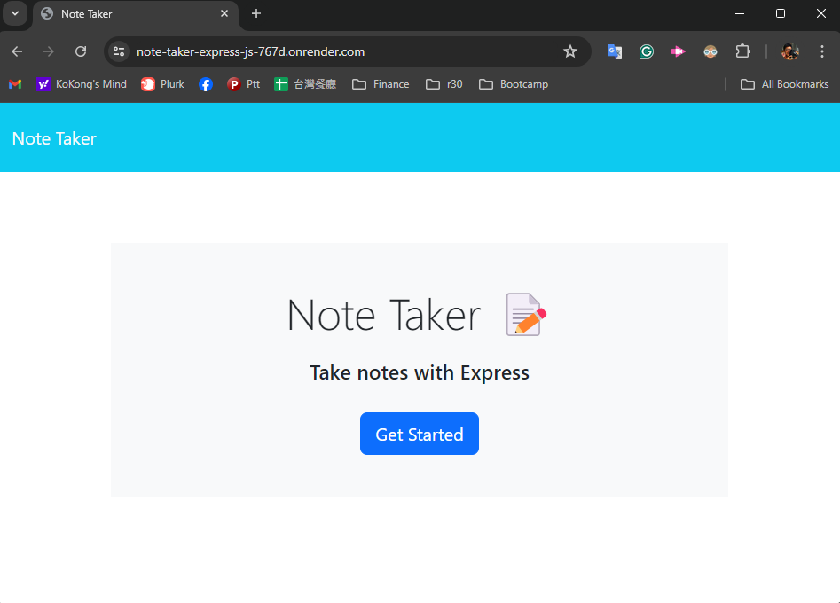
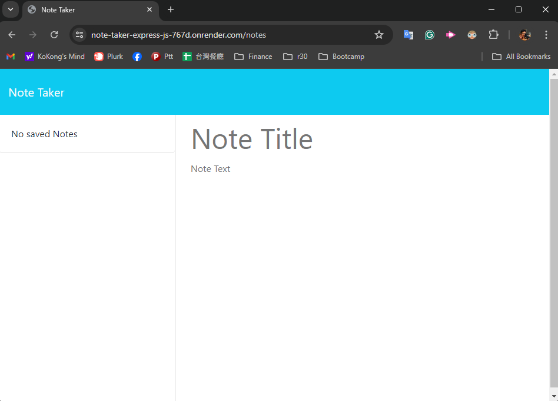
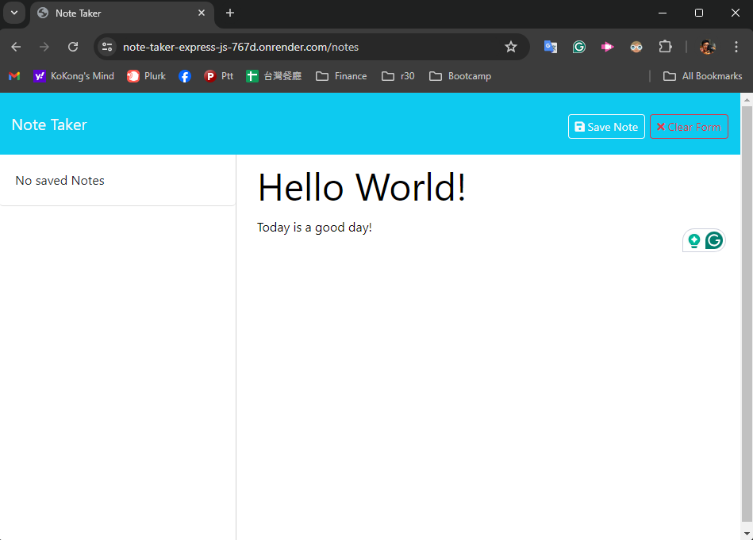
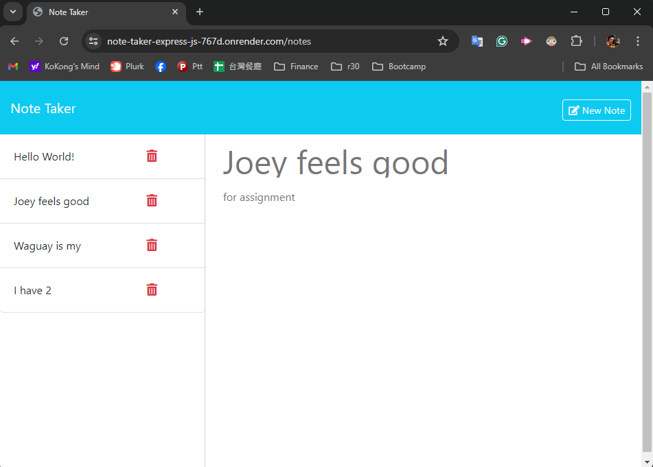
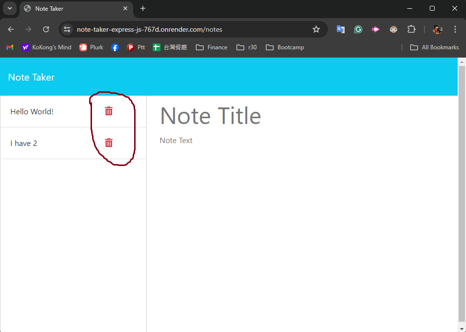
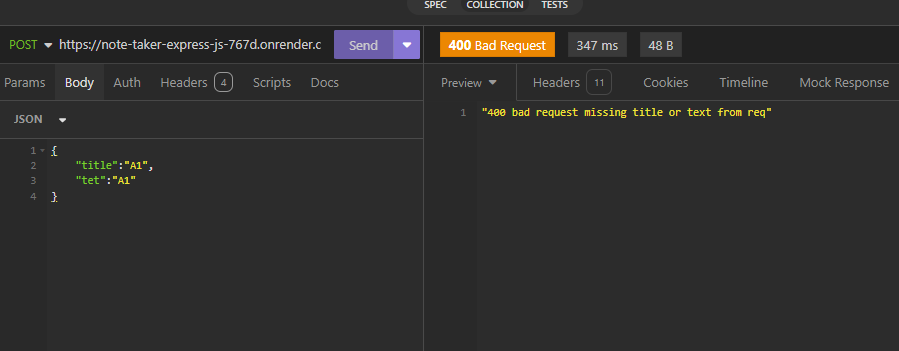
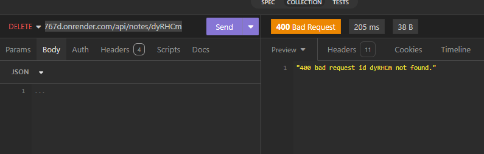

# note-taker-Express.js

***
## Table of content
- note-taker-Express.js
  - [Description](#Description)
  - [Installation](#Installation)
  - [Usage](#Usage)
  - [Tests](#Tests)
  - [Contributing](#Contributing)
  - [License](#License)
  - [Questions](#Questions)
  - [Screenshot](#Screenshot)
***
## Description
This is to setup a Node.js Express backend as the server to take requests for the note taker.  The backend responds to GET, POST and DELETE to interact with the notes.  The note taker frontend(everything in the folder public) is provided by edX Fullstack bootcamp. 
 The helper functions in fsUtils.js are mainly from edX with a tweak to use writeFileSync instead of writeFile.

## Installation
- The generator requires npm.  [See Node.js installation.](https://docs.npmjs.com/downloading-and-installing-node-js-and-npm)
1. Clone the repo: https://github.com/momokokong/note-taker-Express.js
2. In the terminal, move to where the cloned local repo is.
3. `npm install`
   - If it does not automatically install the required module, follow below instructions:
     - `npm i express@4.19.2`
     - `npm i short-unique-id@5.2.0`
4. Start the server by `node server.js` in the terminal.  By default it listens to port 3001. 

## Usage
1. Once the server is running, open http://localhost:3001 from a browser.
2. Feel free to play with the note taker from there! You can add, view and delete notes from there.
3. A public running note taker on Render: https://note-taker-express-js-767d.onrender.com/
   - It might take a minute to load if the Render instance is in hibernation.  Nudge nudge wakey wakey.

## Tests
1. Require [Insomnia](https://insomnia.rest/download), API:
   - GET notes `https://note-taker-express-js-767d.onrender.com/api/notes` should return the saved notes with id of each note.
   - POST note `https://note-taker-express-js-767d.onrender.com/api/notes` with a request body containing a JSON object {"title":string,"text":string} would add a new note.  Return status code 400 if the request is bad.
   - DELETE note `https://note-taker-express-js-767d.onrender.com/api/notes/:id` where id indicates the note you would like to delete.  You can find the id from the GET request.  Return status code 400 if the id is not found. 

## Contributing
Contact me.  Find my information in the [Questions](#Questions) section.

## License
This project adopts WTFPL license practices. Check the website for license details: [License: WTFPL](http://www.wtfpl.net/about/)

## Questions
[momokokong's GitHub profile.](https://github.com/momokokong)

[Po Shin Huang Linkedin profile](https://www.linkedin.com/in/poshinhuang/)

## Screenshot
- Note Taker landing page.  Click on Get Started to the notes:

- Notes page starts with no note:  

- Enter something in "Note Title" and "Note Text" sections and then click on Save Note :  

- Click on the left to read note:  

- Click on the trash can to delete note:  

- In Insomnia, see the error code for POST:  

- In Insomnia, see the error code for DELETE:  

